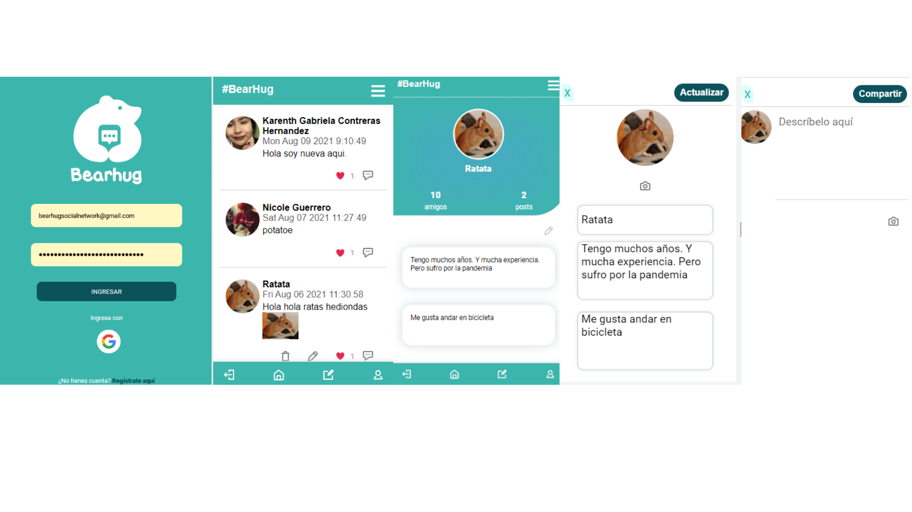
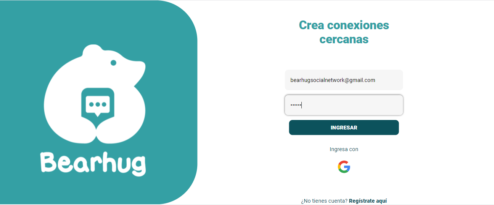
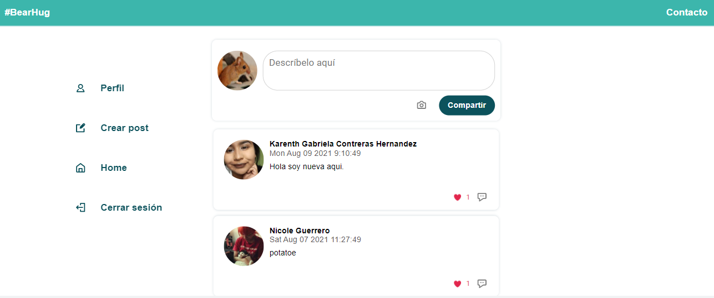
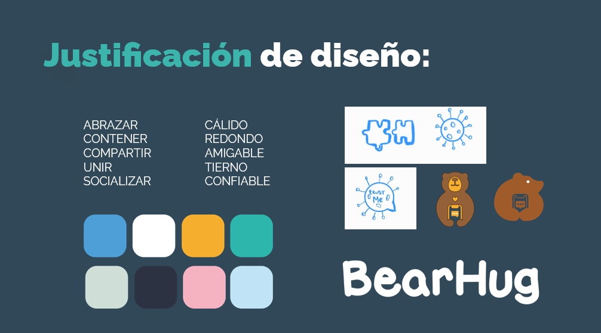
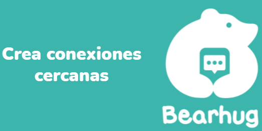
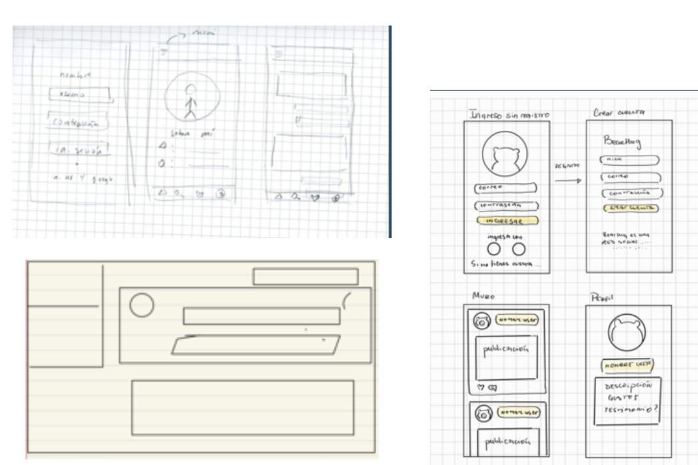

# BEARHUG

## Índice

* [BearHug](#BearHug)
* [Interfaz](#interfaz)
* [Prototipos](#prototipos)
* [Historias de usuario](#historias-de-usuario)
* [Test de usabilidad](#test-de-usabilidad)
* [Tecnologías](#tecnologias)
* [Enlace](#enlace)

## BearHug 
Es una red social enfocada en el  apoyo y contención para personas que estan siendo afectadas por la crisis pandémica Covid-19. Sus principales usuarios son  personas que se encuentran solas, enfermas o con relaciones conflictivas provocadas por el encierro y el miedo a la incertidumbre. Compartiendo sus experiencias a traves de post de manera publica y obtener información, sentirse identificados y crear conexiones mas cercanas. 
Toda la informacion se actualiza de manera  inmediata: permite que los usuarios pueden estar en contacto desde cualquier parte del mundo en tiempo real.
Sin embargo, cada  o publicación solo puede contener 280 caracteres, siendo breve el consumo de informacion e eficiente. 
Para publicar, los usuarios pueden hacerlo desde sus cuentas a través de la web, podiendose registar con google o su corro electronico.
Cada usuario tiene un perfil unico, donde puede entregar información de su boigrafia, y sus interese y poderlos editar y actualizarlo en tiempo real. Así mismo puede visualizar solo sus publicaciones en  el perfil.
En las interacciones puede indicar un "like", por cada publicacion en el muro, tambien elimiar y editar el post creado por el usuario dandole manejo de sus publicaciones para crear una mejor satifaccion de experiencia.

## Interfaz
### Mobil
 

### Desktop
<details>


  
 

</details>

## Prototipos
### 1. Justificación del Diseño
En el proceso del desarrollo de la pagina se itero en la experiencia de usario, brindando una pagina minimalista con colores que reflejan lo que los usuarios buscan en Bearhug. 


Como resultado se definé una paleta de colores basada solo en 3 pricipales, y un logotipo que hace referencia a la esencia  de la red.


### 2. Prototipos baja fidelidad:
<details>


</details>

### 3. Prototipo alta fidelidad:


[Prototipos en Figma](https://www.figma.com/proto/UAiGqTbsTUJqxgKLDGfsPS/Team-Yoyo---BearHug?node-id=258%3A68&scaling=scale-down&page-id=0%3A1)
## Historias de usuario
### 1. Quiero una aplicacion simple, donde pueda registrarne por correo o google, para crear conexiones.
````
CRITERIOS DE ACEPTACIÓN:
- Una sola pantalla que permita registro o inicio de sesion
- Conectar login con firebase
- Validar cuenta con firebase.
- Diseño mobil first

DEFINICIÓN DE TERMINADO
- Creacion de rutas.
- Html dinamico.
- Distribucion de elemento con CssGrid.
- Funciones de Firebase: Init, Login(correo, google), Logout.
````
### 2. Quiero poder compartir mi situacion a través de post.
````
CRITERIOS DE ACEPTACIÓN:
- Una pantalla que permita visualizar el post.
- Una pantalla para crear publicaciones en mobil y en desktop en el mismo home con un modal en el menu.
- Al publicar se debe validar que haya contenido en el input.
- Al recargar se debe verificar si el usuario esta logueado para mostrar el conteniddo.

DEFINICIÓN DE TERMINADO:

````
### 3. Quiero poder eliminar, editar mis publicaciones y darle like a los post publicos.
````
CRITERIOS DE ACEPTACIÓN:
- Poder eliminar un post especifico. 
- Pedir confirmacion antes de eliminar un post.
- Al dar click para editar un post , debe cambiar el texto por un input 
- Poder dar y quitar like a una publicacion. Maximo una por usuario.

DEFINICIÓN DE TERMINADO:

````
### 4. Quiero tener un perfil donde pueda tener informacion sobre mi.
````
 CRITERIOS DE ACEPTACIÓN:
- Crear una pantalla que contega un perfil. 
- Manipular la data y visualizar la data entregada por el usuario. 
- Crear segmento donde pueda colocar imagen de perfil. y descripcion.
- Boton menu perfil. 
 DEFINICIÓN DE TERMINADO:
````
### 5. Quiero poder compartir imagenes en mis post y editar mi perfil
````
CRITERIOS DE ACEPTACIÓN:
DEFINICIÓN DE TERMINADO:
````
## Test de usabilidad

## Tecnologías

## Enlace
